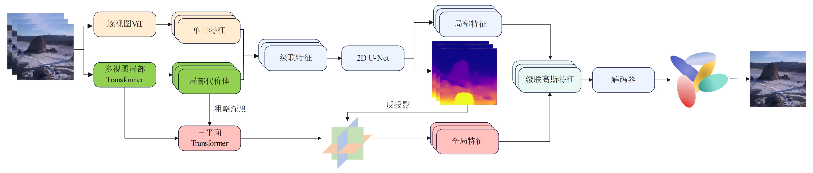
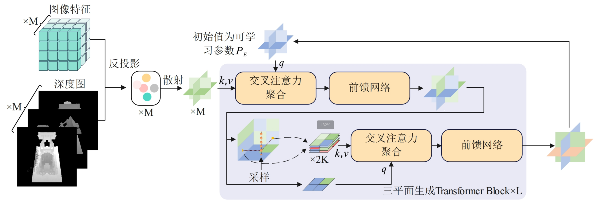
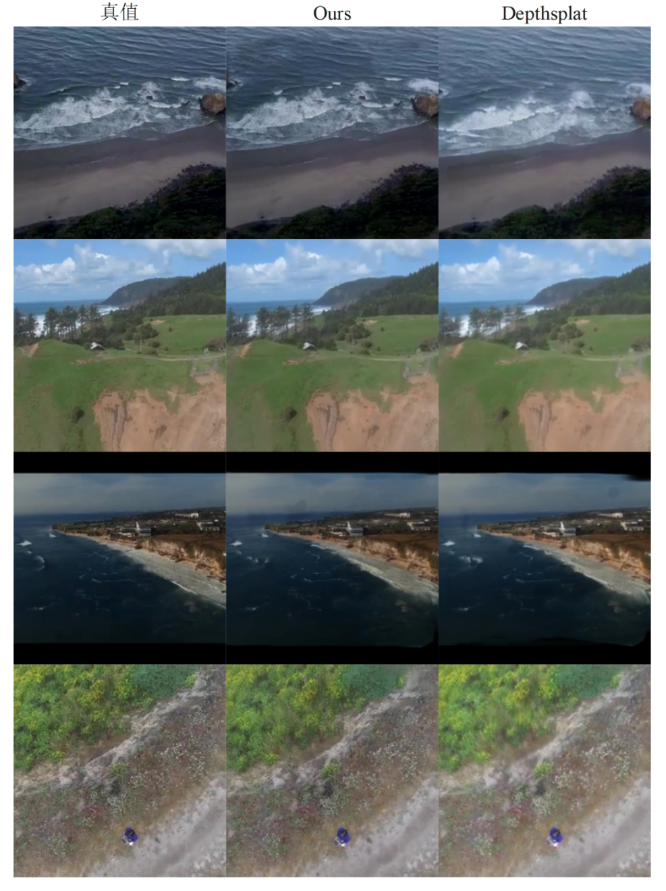
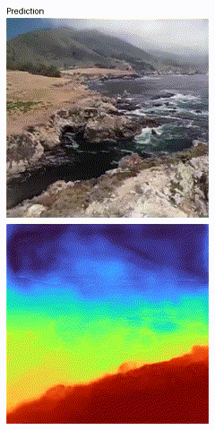
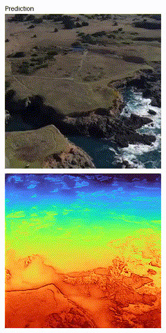

# Global-Aware DepthSplat (GA-DSplat): Enhancing Global Scene Consistency with Triplane Global Features




## GA-DSplat

本项目基于[DepthSplat](https://github.com/cvg/depthsplat)框架，针对Depthsplat受制于性能，立体匹配只能使用近邻K张视图的缺点，引入全局三平面特征补足全局信息，从而增强模型在密集视图表现下的全局一致性。

## 📊 效果对比 (Performance Comparison)

ACID数据集完整管线的定量结果，4张视图：

|                         模型                          | PSNR ↑ | SSIM ↑ | LPIPS ↓ |
| :---------------------------------------------------: | :----: | :----: | :-----: |
| [pixelSplat](https://github.com/dcharatan/pixelsplat) | 20.15  | 0.704  |  0.278  |
|    [MVSplat](https://github.com/donydchen/mvsplat)    | 20.30  | 0.739  |  0.246  |
|    [DepthSplat](https://github.com/cvg/depthsplat)    | 26.34  | 0.869  |  0.151  |
|     [GGN](https://github.com/shengjun-zhang/GGN)      | 26.46  | 0.785  |  0.175  |
|                         Ours                          | **28.88**  | **0.870**  |  **0.149**  |

ACID数据集完整管线的定量结果，8张视图：

|                         模型                          | PSNR ↑ | SSIM ↑ | LPIPS ↓ |
| :---------------------------------------------------: | :----: | :----: | :-----: |
| [pixelSplat](https://github.com/dcharatan/pixelsplat) | 18.84  | 0.692  |  0.304  |
|    [MVSplat](https://github.com/donydchen/mvsplat)    | 19.02  | 0.705  |  0.280  |
|    [DepthSplat](https://github.com/cvg/depthsplat)    | 23.98  | 0.829  |  0.183  |
|     [GGN](https://github.com/shengjun-zhang/GGN)      | 26.94  | 0.793  |  0.170  |
|                         Ours                          | **27.26**  | **0.835**  |  **0.170**  |

ACID数据集完整管线的定量结果，16张视图：

|                         模型                          | PSNR ↑ | SSIM ↑ | LPIPS ↓ |
| :---------------------------------------------------: | :----: | :----: | :-----: |
| [pixelSplat](https://github.com/dcharatan/pixelsplat) | 17.32  | 0.665  |  0.313  |
|    [MVSplat](https://github.com/donydchen/mvsplat)    | 17.64  | 0.672  |  0.279  |
|    [DepthSplat](https://github.com/cvg/depthsplat)    | 22.79  | 0.791  |  0.214  |
|     [GGN](https://github.com/shengjun-zhang/GGN)      | **27.69**  | **0.814**  |  **0.162**  |
|                         Ours                          | 26.15  | 0.800  |  0.192  |

## 🔧 核心改进 (Key Improvements)

+ 同3DGS的Splatting渲染RGB图类似，使用Splatting渲染特征三平面



+ 16张输入视图时的定性比较



+ 小幅相机扰动可视化

|  |  |
|--------|---------------|
|  |  |

## 🚀 使用 (Usage)

### 模型

- 注意，模型核心部分还未开源，但是我们会在论文准备完成后开源。

## 数据集

你可以在这里下载到数据集：[ACID](https://hyper.ai/cn/datasets/20569)，[RealEstate10K](https://google.github.io/realestate10k/download.html)，[DL3DV-10K](https://github.com/DL3DV-10K/Dataset)

### 评估

#### ACID

<details>
<summary>评估脚本 (迷你，标准，完整模型)</summary>

- 评估迷你模型:

```
# Table 1 of depthsplat paper
CUDA_VISIBLE_DEVICES=0 python -m src.main +experiment=acid \
dataset.test_chunk_interval=1 \
model.encoder.upsample_factor=4 \
model.encoder.lowest_feature_resolution=4 \
checkpointing.pretrained_model=pretrained/depthsplat-gs-small-re10k-256x256-view2-cfeab6b1.pth \
mode=test \
dataset/view_sampler=evaluation
```

<!-- </details>

<details>
<summary><b>评估标准模型, 使用:</b></summary> -->


- 评估标准模型:

```
# Table 1 of depthsplat paper
CUDA_VISIBLE_DEVICES=0 python -m src.main +experiment=acid \
dataset.test_chunk_interval=1 \
model.encoder.num_scales=2 \
model.encoder.upsample_factor=2 \
model.encoder.lowest_feature_resolution=4 \
model.encoder.monodepth_vit_type=vitb \
checkpointing.pretrained_model=pretrained/depthsplat-gs-base-re10k-256x256-view2-ca7b6795.pth \
mode=test \
dataset/view_sampler=evaluation
```

<!-- </details>

<details>
<summary><b>评估完整模型, 请用:</b></summary> -->


- 评估完整模型: 

```
# Table 1 of depthsplat paper
CUDA_VISIBLE_DEVICES=0 python -m src.main +experiment=acid \
dataset.test_chunk_interval=1 \
model.encoder.num_scales=2 \
model.encoder.upsample_factor=2 \
model.encoder.lowest_feature_resolution=4 \
model.encoder.monodepth_vit_type=vitl \
checkpointing.pretrained_model=pretrained/depthsplat-gs-large-re10k-256x256-view2-e0f0f27a.pth \
mode=test \
dataset/view_sampler=evaluation

```

</details>

### Training

- 在训练之前，你需要下载这些预训练模型： [UniMatch](https://github.com/autonomousvision/unimatch) 和[Depth Anything V2](https://github.com/DepthAnything/Depth-Anything-V2) 的权重, 并设置你的[wandb account](config/main.yaml) (in particular, by setting `wandb.entity=YOUR_ACCOUNT`) 来登录.（你可以通过设置`wandb.mode=offline或disabled`来避免网络问题）

```
wget https://s3.eu-central-1.amazonaws.com/avg-projects/unimatch/pretrained/gmflow-scale1-things-e9887eda.pth -P pretrained
wget https://huggingface.co/depth-anything/Depth-Anything-V2-Small/resolve/main/depth_anything_v2_vits.pth -P pretrained
```

- 你可以参考脚本 [scripts/re10k_depthsplat_train.sh](scripts/re10k_depthsplat_train.sh) 和[scripts/dl3dv_depthsplat_train.sh](scripts/dl3dv_depthsplat_train.sh) 来找到用于训练的指令。我们的模型使用一张H800进行训练，对于small模型来说，两视图用于训练时，它会占用GB左右显存用于训练。
- 你可以通过设置`dataset.view_sampler=boundedv3`来启用随机输入视图数量，这会让模型在多视图情况下表现更好，但在两视图情况下造成一定性能下降。并且`boundedv3`无法进行batch打包，你必须禁用数据集的多线程加载，即设置`num_worker=0`。


## Acknowledgements

本项目基于以下的优秀工作: [DepthSplat](https://github.com/cvg/depthsplat), [pixelSplat](https://github.com/dcharatan/pixelsplat), [MVSplat](https://github.com/donydchen/mvsplat), [MVSplat360](https://github.com/donydchen/mvsplat360), [UniMatch](https://github.com/autonomousvision/unimatch), [Depth Anything V2](https://github.com/DepthAnything/Depth-Anything-V2) and [DL3DV](https://github.com/DL3DV-10K/Dataset)，感谢它们的开源分享。